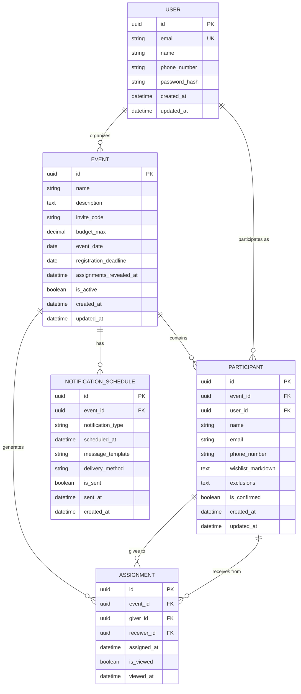
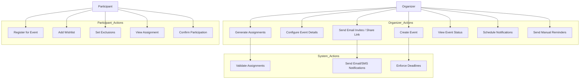
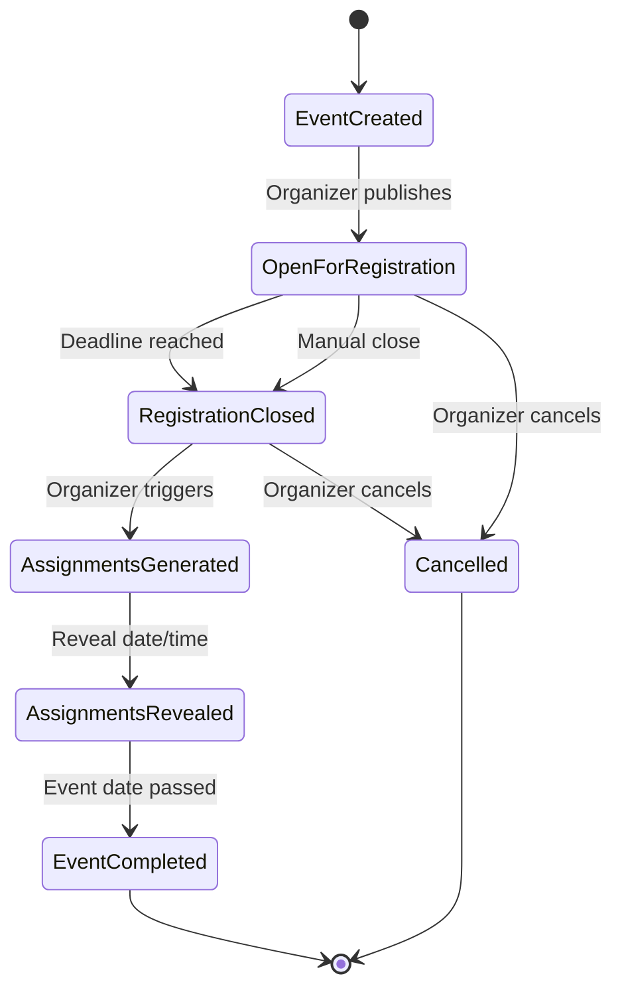
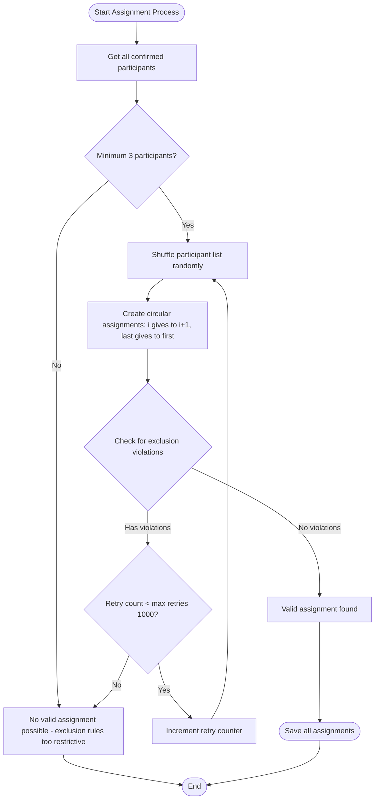
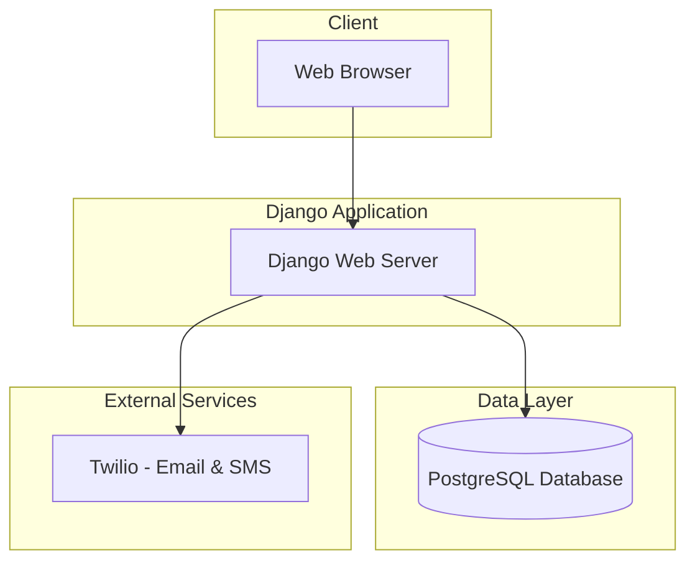
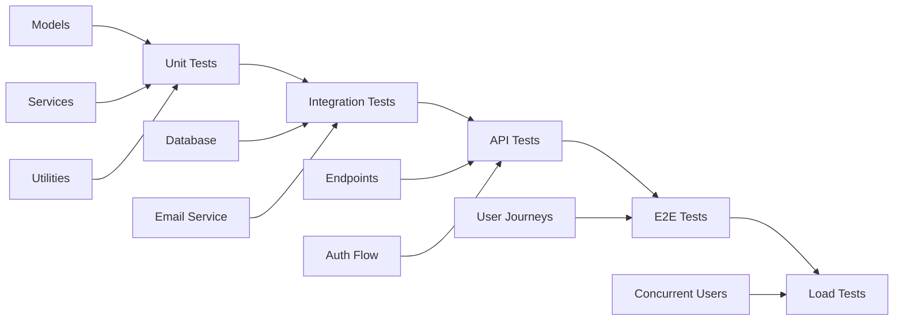

# Secret Santa Website - MERISE Plan

## Project Overview
A web application to manage Secret Santa events where participants are randomly assigned gift recipients while maintaining anonymity.

---

## 1. Conceptual Data Model (MCD - Modèle Conceptuel de Données)

### Entities and Relationships

---

## 2. Logical Data Model (MLD - Modèle Logique de Données)

### Tables and Constraints

**USERS**
- id (UUID, PK)
- email (VARCHAR, UNIQUE, NOT NULL)
- name (VARCHAR, NOT NULL)
- phone_number (VARCHAR, NULLABLE)
- password_hash (VARCHAR, NOT NULL)
- created_at (TIMESTAMP)
- updated_at (TIMESTAMP)

**EVENTS**
- id (UUID, PK)
- organizer_id (UUID, FK → USERS.id)
- name (VARCHAR, NOT NULL)
- description (TEXT, NULLABLE)
- invite_code (VARCHAR, UNIQUE, NOT NULL) - Short code for invite links
- budget_max (DECIMAL, NULLABLE)
- event_date (DATE, NOT NULL)
- registration_deadline (DATE)
- assignments_revealed_at (TIMESTAMP)
- is_active (BOOLEAN, DEFAULT TRUE)
- created_at (TIMESTAMP)
- updated_at (TIMESTAMP)

**PARTICIPANTS**
- id (UUID, PK)
- event_id (UUID, FK → EVENTS.id)
- user_id (UUID, FK → USERS.id, NULLABLE)
- name (VARCHAR, NOT NULL)
- email (VARCHAR, NOT NULL)
- phone_number (VARCHAR, NULLABLE)
- wishlist_markdown (TEXT, NULLABLE) - Markdown formatted wishlist, parsed as list
- exclusions (TEXT, NULLABLE)
- is_confirmed (BOOLEAN, DEFAULT FALSE)
- created_at (TIMESTAMP)
- updated_at (TIMESTAMP)
- UNIQUE(event_id, email)

**ASSIGNMENTS**
- id (UUID, PK)
- event_id (UUID, FK → EVENTS.id)
- giver_id (UUID, FK → PARTICIPANTS.id)
- receiver_id (UUID, FK → PARTICIPANTS.id)
- assigned_at (TIMESTAMP)
- is_viewed (BOOLEAN, DEFAULT FALSE)
- viewed_at (TIMESTAMP)
- UNIQUE(event_id, giver_id)
- CHECK(giver_id != receiver_id)

**NOTIFICATION_SCHEDULES**
- id (UUID, PK)
- event_id (UUID, FK → EVENTS.id)
- notification_type (VARCHAR, NOT NULL) - e.g., 'registration_reminder', 'assignment_reveal', 'event_reminder'
- scheduled_at (TIMESTAMP, NOT NULL)
- message_template (TEXT, NULLABLE)
- delivery_method (VARCHAR, NOT NULL) - e.g., 'email', 'sms', 'both'
- is_sent (BOOLEAN, DEFAULT FALSE)
- sent_at (TIMESTAMP, NULLABLE)
- created_at (TIMESTAMP)

---

## 3. Use Case Diagram

---

## 4. Activity Flow - Event Lifecycle

---

## 5. Assignment Algorithm Flow

---

## 6. Deployment Architecture

---

## 7. Key Business Rules

### Event Management
1. Event must have at least 3 confirmed participants before assignments can be generated
2. Registration deadline must be before event date
3. Assignments can only be revealed after generation
4. Only event organizer can generate assignments
5. Notification schedules can be created by event organizers (for Phase 2)
6. For MVP: notifications sent immediately (scheduled notifications in Phase 2)

### Participant Management
1. Participants join events via invite link (using invite code) or email invitation
2. Participants must have unique email within an event
3. Participants can optionally link to a user account
4. Participants must confirm participation before assignments
5. Exclusions must be reciprocal (if A excludes B, B excludes A)

### Assignment Rules
1. No self-assignments allowed
2. Each participant gives to exactly one person
3. Each participant receives from exactly one person
4. Assignments form a circular chain
5. Exclusion rules must be respected
6. Once viewed, assignments cannot be regenerated

### Security
1. Assignments are only visible to the assigned giver (enforced by views/permissions)
2. Email verification required for participant confirmation
3. Organizers cannot view specific assignments (UI/permission restriction)
4. Audit logging for assignment views

---

## 8. API Endpoints Structure

### Events (Django Views/URLs)
- `POST /events/create/` - Create event (generates unique invite code)
- `GET /events/<id>/` - View event details
- `GET /join/<invite_code>/` - Join event by invite code
- `POST /events/<id>/edit/` - Update event
- `POST /events/<id>/delete/` - Delete event
- `POST /events/<id>/generate-assignments/` - Generate assignments
- `GET /events/<id>/participants/` - List participants
- `POST /events/<id>/send-invites/` - Send email invites to list of emails

### Notification Schedules
- `POST /events/<id>/notifications/create/` - Create notification schedule
- `GET /events/<id>/notifications/` - List scheduled notifications
- `POST /notifications/<id>/edit/` - Update notification schedule
- `POST /notifications/<id>/delete/` - Delete notification schedule
- `POST /notifications/<id>/send-now/` - Send notification immediately

### Participants
- `POST /events/<id>/join/` - Join event as participant
- `GET /participants/<id>/` - View participant profile
- `POST /participants/<id>/edit/` - Update participant info
- `POST /participants/<id>/remove/` - Remove participant
- `POST /participants/<id>/confirm/` - Confirm participation

### Assignments
- `GET /events/<event_id>/my-assignment/` - View my assignment (authenticated)
- `GET /events/<id>/assignments/status/` - View assignment status (organizer only)

### Authentication (Django-allauth)
- `POST /accounts/signup/` - Register user
- `POST /accounts/login/` - Login
- `POST /accounts/logout/` - Logout
- `POST /accounts/password/reset/` - Reset password
- `GET /accounts/confirm-email/<key>/` - Verify email
- `GET /accounts/<provider>/login/` - Social authentication (Google, Facebook, etc.)
- `GET /accounts/profile/` - View/edit user profile

---

## 9. Technology Stack Recommendations

### Backend
- **Framework**: Django (Python)
- **Authentication**: Django-allauth
- **Database**: PostgreSQL
- **Email & SMS Service**: Twilio SendGrid (Email) + Twilio SMS
- **Template Engine**: Django Templates
- **Static Files**: Django Static Files (WhiteNoise for production)

### Frontend
- **Framework**: Django Templates (server-side rendering)
- **UI Library**: Tailwind CSS or Bootstrap
- **JavaScript**: Vanilla JS or Alpine.js (for interactivity)
- **Markdown**: Python markdown library (server-side rendering)

### DevOps
- **Web Server**: Gunicorn + Nginx
- **Container**: Docker (optional)
- **CI/CD**: GitHub Actions
- **Hosting**: VPS, Railway, Render, PythonAnywhere, or similar
- **Monitoring**: Django Debug Toolbar (dev), Sentry (production)

---

## 10. Development Phases

### Phase 1: MVP (Minimum Viable Product)
- User authentication with Django-allauth
- Email verification via Twilio SendGrid
- Event creation with unique invite code generation
- Share event via invite link
- Send email invitations to participants via Twilio SendGrid
- Participant registration via invite link or email
- Basic assignment generation
- Email notifications via Twilio SendGrid
- SMS notifications via Twilio

### Phase 2: Enhanced Features
- Wishlist management (markdown formatted with list parsing)
- Markdown editor/preview for wishlists
- Exclusion rules
- Assignment scheduling
- Event templates
- Scheduled notification system (automated reminders) - Add background task solution
- User notification preferences (Email/SMS/Both)
- Custom notification templates

### Phase 3: Advanced Features
- Social authentication (Google, Facebook, GitHub)
- Multi-language support (Django i18n)
- Payment integration for gift purchases
- Chat between participants (anonymous) via WebSockets
- Event analytics and history
- Progressive Web App (PWA) features

### Phase 4: Scale & Optimize
- Performance optimization
- Advanced caching
- Multi-region deployment
- Enhanced security features
- Admin dashboard

---

## 11. Security Considerations

1. **Data Protection**
   - Hash passwords with Django's default (PBKDF2)
   - Implement HTTPS only in production
   - Secure session cookies (HttpOnly, Secure, SameSite)
   - CSRF protection (Django default)

2. **Access Control**
   - Role-based permissions (Organizer vs Participant)
   - Django-allauth for authentication
   - View-level permissions to prevent unauthorized access
   - Organizers cannot access assignment detail views
   - Participants can only view their own assignment
   - Email verification required for account activation
   - Phone number validation and verification

3. **Privacy**
   - GDPR compliance considerations
   - Data retention policies
   - Right to deletion (allow users to delete accounts/events)
   - Anonymity preservation via access controls
   - Audit logging for sensitive operations (viewing assignments)

4. **Input Validation**
   - Django form validation
   - Sanitize markdown input (prevent XSS)
   - Validate email addresses and phone numbers
   - Rate limiting on invite sending to prevent abuse

---

## 12. Testing Strategy

---

## Next Steps

1. Set up Django development environment
2. Install and configure Django-allauth
3. Configure Twilio SendGrid for email
4. Configure Twilio for SMS
5. Initialize PostgreSQL database
6. Create User, Event, Participant, and Assignment models
7. Create NotificationSchedule model (for Phase 2 implementation)
8. Implement email verification flow with Twilio SendGrid
9. Build Django views and URL patterns for events
10. Create Django templates with Tailwind CSS
11. Develop assignment algorithm
12. Implement immediate email notifications via Twilio SendGrid
13. Implement immediate SMS notifications via Twilio
14. Build participant registration flow
15. Create organizer dashboard
16. Write comprehensive tests
17. Configure Gunicorn + Nginx
18. Deploy to staging environment
19. User acceptance testing
