# Secret Santa Style Guide 🎅

This document outlines the coding standards, conventions, and documentation styles for the Secret Santa project.

## 📝 Code Style

We adhere to strict coding standards enforced by pre-commit hooks.

### Python
- **Formatter**: `ruff`
- **Line Length**: 120 characters
- **Target Version**: Python 3.13+
- **Imports**: Standard lib -> Third-party -> Local (sorted by ruff)

### Django
- **Version**: 5.2 (Future-proof patterns)
- **Templates**: Formatted with `djhtml` (4-space tabs), modernized with `djade`

### Documentation
- **Format**: Markdown
- **Linting**: `blacken-docs` ensures code blocks in docs are formatted

## 🎨 Color Scheme

Our color palette reflects a traditional yet modern holiday aesthetic, prioritizing warmth and readability.

| Name | Hex | Variable | Usage |
|------|-----|----------|-------|
| **Forest Green** | `#1e5128` | `--forest-green` | Primary actions, headings, links |
| **Pine** | `#2d6a4f` | `--pine` | Hover states, active badges |
| **Sage** | `#52796f` | `--sage` | Footer text, subtle accents |
| **Deep Red** | `#8b3a3a` | `--deep-red` | Delete actions, errors, festive accents |
| **Gold** | `#d4a574` | `--gold` | Highlights, special badges |
| **Cream** | `#fef9f3` | `--cream` | Main background |
| **Charcoal** | `#2c2c2c` | `--charcoal` | Primary text |
| **Soft Gray** | `#5a5a5a` | `--soft-gray` | Secondary text |

## 🗣️ User Voice & Tone

The Secret Santa voice is **festive, welcoming, and trustworthy**. We want users to feel excited about their event but confident in the privacy and organization of the system.

-   **Festive but Functional**: Use holiday-themed emojis (🎅, 🎁) sparingly to set the mood, but keep instructions clear and direct.
-   **Trustworthy & Private**: Emphasize anonymity and security (e.g., "Completely Anonymous", "Secure assignment viewing").
-   **Simple & Direct**: Avoid jargon. Use active verbs ("Create Event", "Invite Friends", "Exchange Gifts").
-   **Inclusive**: Suitable for friends, families, and office colleagues.

### Examples
-   *Good*: "Spread the joy of giving!"
-   *Good*: "Assignments are kept secret. Even organizers can't see who's giving to whom."
-   *Bad*: "System has generated the directed acyclic graph for gift exchange." (Too technical)

## 🧪 Testing

- **Runner**: `pytest`
- **Conventions**:
  - Use `conftest.py` fixtures
  - No DB migrations during tests (`--nomigrations`)
  - Fast password hasher for speed

## 📊 Visuals & Diagrams

We use [Kroki](https://kroki.kjaymiller.dev) to render diagrams dynamically from text. This allows diagrams to be version-controlled as text while being viewable as images.

### Example Workflow

Here is an example of our development workflow rendered via Kroki:

### How to Add Diagrams
1. Create your diagram using Mermaid, PlantUML, etc.
2. Convert the code to a compressed base64 URL (using the project's helper scripts or online tools).
3. Embed using standard Markdown image syntax: ``

## 🛠️ Tools

- **CLI**: `just` for all common tasks
- **Dependency Management**: `uv`
- **Containerization**: Docker Compose

Run `just --list` to see all available commands.
